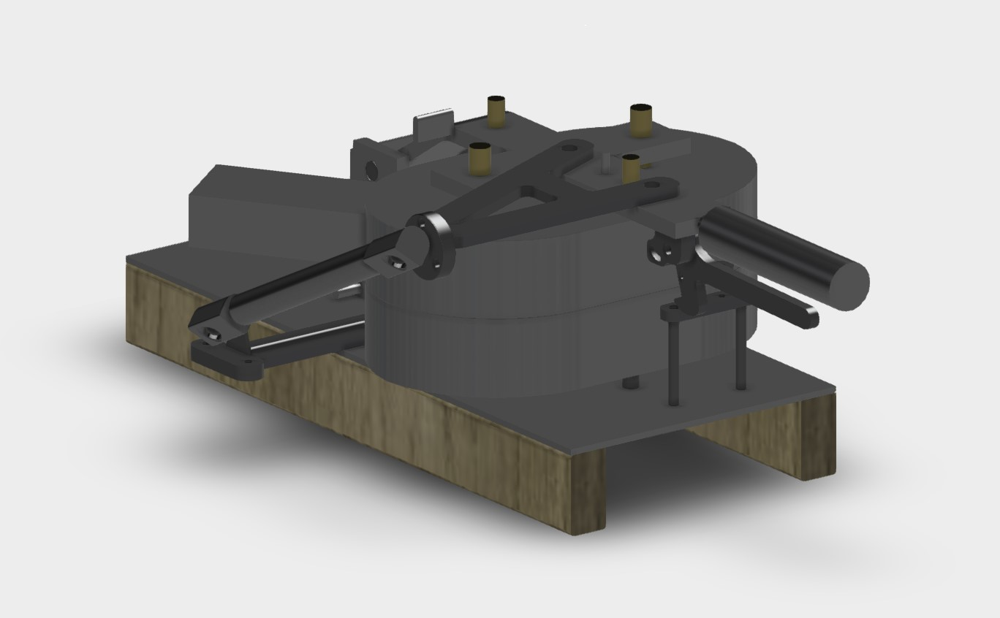
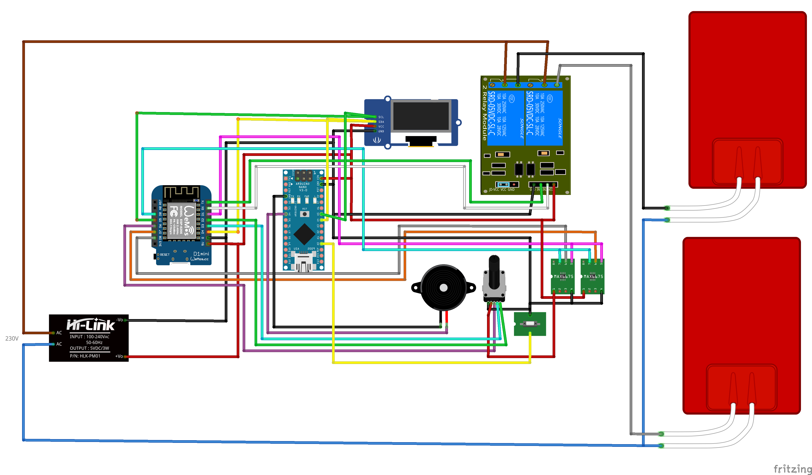
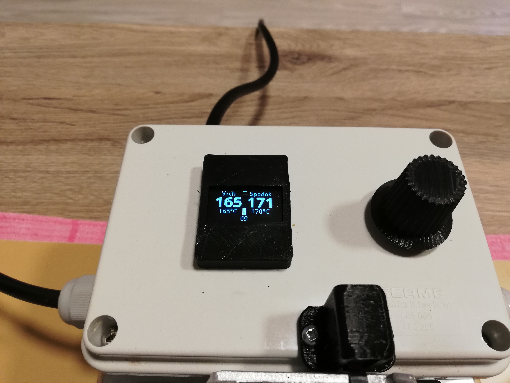
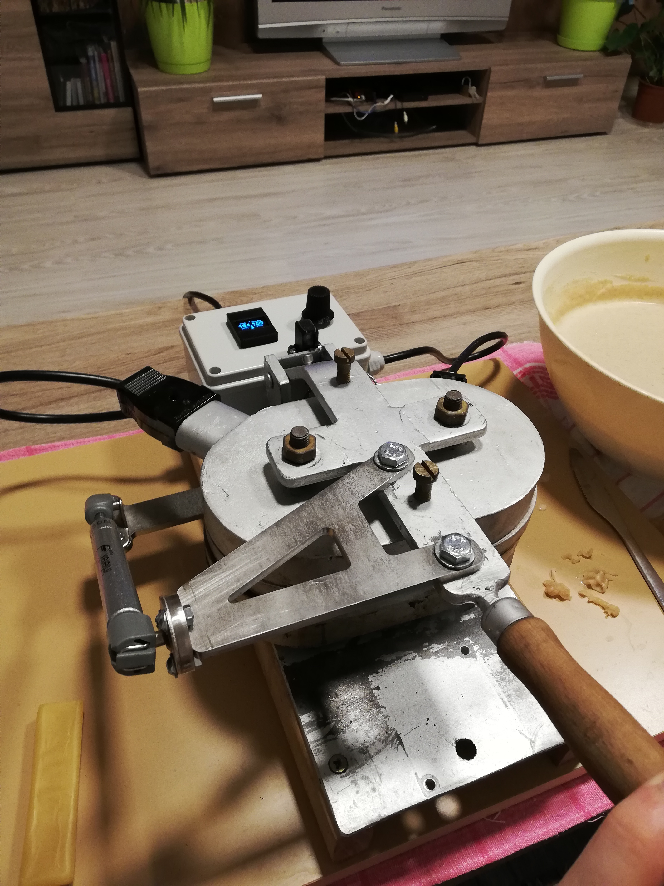
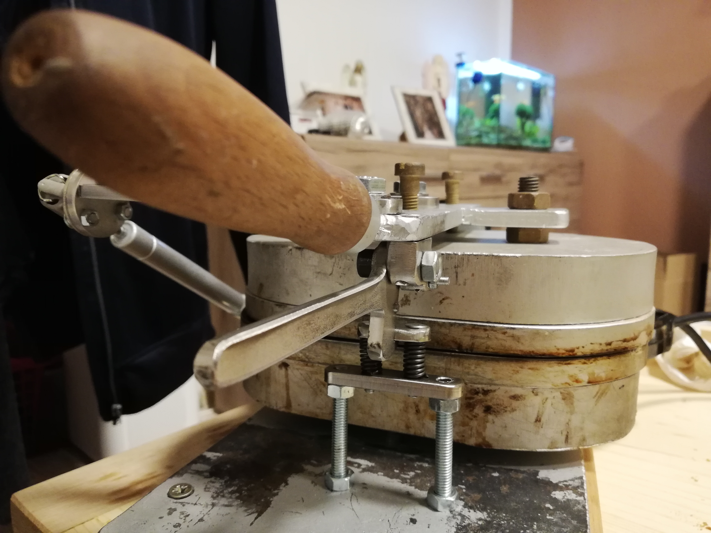
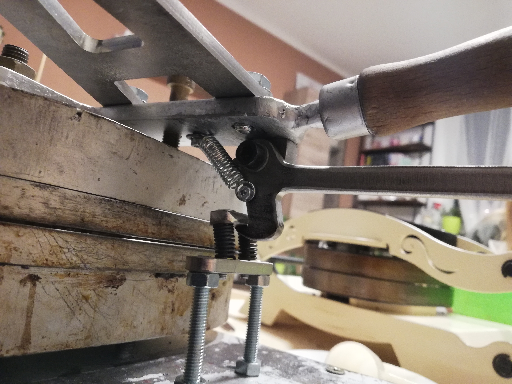
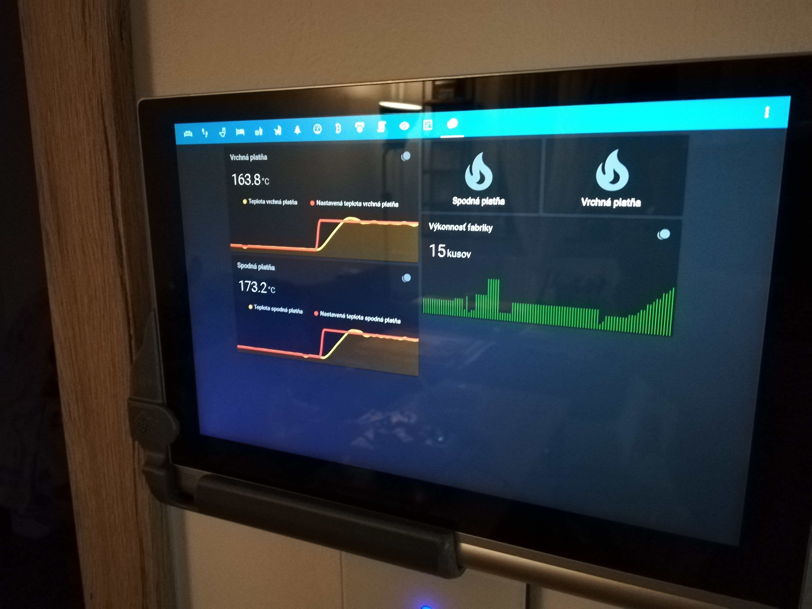

# OplatkoGeret3000
Smart forma na pečenie oplátok. WiFi enabled smart wafer baking machine

## Bill of material
* [Wemos D1 mini](http://s.click.aliexpress.com/e/b7xoMFF6) 
* [Arduino nano 328p](https://www.aliexpress.com/item/4000579100527.html?spm=a2g0o.productlist.0.0.57261a30WA0Gey&algo_pvid=12c55386-1d85-48d8-b2ce-908c0baa45c3&algo_expid=12c55386-1d85-48d8-b2ce-908c0baa45c3-1&btsid=2100bb5116050128564686494e23b9&ws_ab_test=searchweb0_0,searchweb201602_,searchweb201603_) 
* [1.3 Inch OLED display](https://www.aliexpress.com/item/32844104782.html?spm=a2g0s.9042311.0.0.27424c4deUlMyz) 
* [Piezo buzzer](https://www.aliexpress.com/item/4000148640191.html?spm=a2g0o.productlist.0.0.1d2e581b0iR48q&algo_pvid=0c11f333-293e-4d22-91fb-aa024dacc5d9&algo_expid=0c11f333-293e-4d22-91fb-aa024dacc5d9-1&btsid=2100bb4c16050129639998410e2c78&ws_ab_test=searchweb0_0,searchweb201602_,searchweb201603_) 
* [Rotary encoder with push button](https://www.aliexpress.com/item/32829191434.html?spm=a2g0o.productlist.0.0.22cb4e993UFooZ&algo_pvid=239d5382-3347-472b-84e7-979b383e687e&algo_expid=239d5382-3347-472b-84e7-979b383e687e-29&btsid=0b0a050116050130080311446edede&ws_ab_test=searchweb0_0,searchweb201602_,searchweb201603_) 
* [End stop limit switch](https://www.aliexpress.com/item/4000905809810.html?spm=a2g0o.productlist.0.0.52ac3879h9EBwM&algo_pvid=fa7fe20c-a1ea-4e2b-b786-e8fb13fdc180&algo_expid=fa7fe20c-a1ea-4e2b-b786-e8fb13fdc180-4&btsid=2100bb4c16050130537235319e2c79&ws_ab_test=searchweb0_0,searchweb201602_,searchweb201603_) 
* [2x K-type thermocouple with MAX6675](https://www.aliexpress.com/item/32850697464.html?spm=a2g0s.9042311.0.0.27424c4dzQOdiu) 
* [AC-DC Step down ](https://www.aliexpress.com/item/4001240949958.html?spm=a2g0o.productlist.0.0.49a56129P7ufWQ&algo_pvid=bee91c9f-5a57-48ad-99f6-07415bee63ad&algo_expid=bee91c9f-5a57-48ad-99f6-07415bee63ad-0&btsid=2100bb5116050131966227386e23cd&ws_ab_test=searchweb0_0,searchweb201602_,searchweb201603_) 
* [2-channel relay module](https://www.aliexpress.com/item/32725043697.html?spm=a2g0o.productlist.0.0.4401bef4xf6H0a&algo_pvid=8b19abc8-264d-4357-b6a9-33dfbb518655&algo_expid=8b19abc8-264d-4357-b6a9-33dfbb518655-3&btsid=2100bdf016050132390442092e450d&ws_ab_test=searchweb0_0,searchweb201602_,searchweb201603_) 
* Some wires, tools, Wago connectors
* Plastic box for electronics enclousure

## Device basics
There are 2 Thermocouple probes in each of heating plates, I just drilled hole from back and screwed the probe in. Device is running ESPhome firmware with customized arduino sketch for port extender, I hard coded port D4 on arduino to act as piezo buzzer output. Code is simply checking the temperature +- some heat delay, and simply by turning relays on and off it is controlling the heat. All is connected to HomeAssistant, hence the choosen firmware. I can modify the code through OTA updates right from console. It could be used without WiFi connections, there is need to adjust auto restart options after unsucessfull connection to AP and HA instance. 

Device is simply counting time from opening the top lid, and when the time runs out, the buzzer play beep as indication as wafer should be baked. So you need to watch for first batch, and then use timer feature as the times should be pretty similiar through all the baking process. 

## Disclaimer
We are dealing with dangerous high voltages, You should really know what you are doing. Any information provided on this site are absolutely without guarantee. I am trying my best to minimize all kinds of errors and misinterpretations, however I am not responsible for any material or health damage caused by anyone or anything trying to replicate this project, or use any information from this site.  

## Firmware
You can find attached ["ESPHome project" file](oplatkogeret.yaml). Menus and comments are mainly in Slovak language, however display is showing numbers only, and if you will try to integrate this to your HomeAssistant instance, you can find [more information about ESPHome here](https://esphome.io/).

## Schematics

## Video from operation
[You can see short video of timer in action here](https://www.facebook.com/1228769208/videos/pcb.10217100440603012/10217100434962871/)

## Pictures from build

### If You liked my work, You can buy me a coffee :)

### Or send some crypto

	
			